# FyLab – Benutzerhandbuch

**Finanzlabor · Version 1.0.0 · Stephan Epp · März 2026**

---

## Inhaltsverzeichnis

1. [Einführung und Motivation](#1-einführung-und-motivation)
2. [Installation und Start](#2-installation-und-start)
3. [Architekturübersicht](#3-architekturübersicht)
4. [Modul `core` – Grunddatenmodelle](#4-modul-core--grunddatenmodelle)
   - 4.1 [Konto und Transaktionen](#41-konto-und-transaktionen)
   - 4.2 [Cashflow-Planung](#42-cashflow-planung)
   - 4.3 [Portfolio und Assets](#43-portfolio-und-assets)
   - 4.4 [Währungskonverter](#44-währungskonverter)
5. [Modul `algorithms` – Graphalgorithmen](#5-modul-algorithms--graphalgorithmen)
   - 5.1 [Subgraph-Isomorphismus (Kernalgorithmus)](#51-subgraph-isomorphismus-kernalgorithmus)
   - 5.2 [Betrugserkennung](#52-betrugserkennung)
   - 5.3 [Arbitrage-Erkennung (Bellman-Ford)](#53-arbitrage-erkennung-bellman-ford)
   - 5.4 [Schuldenausgleich & Max-Flow (Edmonds-Karp)](#54-schuldenausgleich--max-flow-edmonds-karp)
   - 5.5 [Portfolio-Diversifikation via MST (Kruskal)](#55-portfolio-diversifikation-via-mst-kruskal)
6. [Modul `analysis` – Risikoanalyse & Portfolio-Optimierung](#6-modul-analysis--risikoanalyse--portfolio-optimierung)
   - 6.1 [Value-at-Risk und CVaR](#61-value-at-risk-und-cvar)
   - 6.2 [Monte-Carlo-Simulation](#62-monte-carlo-simulation)
   - 6.3 [Markowitz-Effizienzgrenze](#63-markowitz-effizienzgrenze)
7. [Modul `visualization` – Diagramme und Graphen](#7-modul-visualization--diagramme-und-graphen)
8. [Modul `gui` – Grafische Benutzeroberfläche](#8-modul-gui--grafische-benutzeroberfläche)
   - 8.1 [Hauptfenster](#81-hauptfenster)
   - 8.2 [AccountWidget](#82-accountwidget)
   - 8.3 [PortfolioWidget](#83-portfoliowidget)
   - 8.4 [CashflowWidget](#84-cashflowwidget)
   - 8.5 [GraphWidget](#85-graphwidget)
   - 8.6 [RiskWidget](#86-riskwidget)
9. [Theoretischer Hintergrund: Finanzprobleme als Graphprobleme](#9-theoretischer-hintergrund-finanzprobleme-als-graphprobleme)
10. [Vollständige Python-Beispiele](#10-vollständige-python-beispiele)
11. [Tests und Qualitätssicherung](#11-tests-und-qualitätssicherung)
12. [Abbildungsverzeichnis](#12-abbildungsverzeichnis)

---

## 1  Einführung und Motivation

FyLab (*Finanzlabor*) ist ein umfassendes Python-Analyseframework für
Finanzverwaltung, Portfolio-Optimierung, Risikoanalyse und
graphbasierte Finanzalgorithmen.  Es wurde analog zu *PyLab* für die
Regelungstechnik konzipiert und setzt auf

| Bibliothek | Zweck |
|---|---|
| **PyQt6** | GUI-Framework (Widgets, Layouts, Dialoge) |
| **NumPy** | Numerische Berechnungen, Matrizenoperationen |
| **SciPy** | Portfolio-Optimierung (SLSQP) |
| **Matplotlib** | Visualisierungen und Diagramme |
| **subgraph** | Subgraph-Isomorphismus-Algorithmus (extern) |

### Leitidee

> *Finanzmärkte sind Netzwerke.  Aktiva sind Knoten,
> Handelsbeziehungen und Zahlungsströme sind Kanten.
> Viele Optimierungsprobleme der Finanzwelt lassen sich auf
> bekannte graphtheoretische Probleme reduzieren.*

Das **algorithmische Herzstück** ist der Subgraph Algorithmus.
Er löst das Subgraph-Isomorphismusproblem durch zyklische
Spalten-Rotation und polynomiale Hash-Signaturen der Adjazenzmatrix
in `O(n³)` und wird über die zentrale Utility-Funktion
`subgraph_contains(R, G)` in *allen vier* Algorithmusmodulen
konsistent eingesetzt.

### Übersicht der algorithmischen Reduktionen

| Finanzproblem | Reduktion auf | Algorithmus | Komplexität |
|---|---|---|---|
| Portfolio-Diversifikation | MST (Korrelationsgraph) | Kruskal | O(E log V) |
| Arbitrage-Erkennung | Negativer Zyklus | Bellman-Ford | O(VE) |
| Cashflow-Optimierung | Max-Flow | Edmonds-Karp | O(VE²) |
| Schuldenausgleich | Greedy Nettobalanz | Greedy + Sort | O(n log n) |
| Betrugserkennung | **Subgraph-ISO** | **Subgraph Alg.** | O(n³) |
| Systemisches Risiko | SCC | Tarjan | O(V+E) |
| Steueroptimierung | Subset-Sum (NP-hart) | DP-Approx. | pseudopolynomiell |
| Portfolioauswahl | Rucksack (NP-hart) | FPTAS | O(n·W/ε) |

---

## 2  Installation und Start

### Voraussetzungen

- Python ≥ 3.11
- Linux, macOS oder Windows
- Externe `subgraph`-Bibliothek (Epp-Group GitLab)

### Schritt-für-Schritt-Installation

```bash
# 1. Repository klonen
git clone <fylab-repo-url>
cd fylab

# 2. Virtuelle Umgebung anlegen und aktivieren
python3 -m venv venv
source venv/bin/activate        # Linux / macOS
# venv\Scripts\activate         # Windows

# 3. FyLab im Entwicklungsmodus installieren (inkl. dev-Abhängigkeiten)
pip install -e ".[dev]"

# 4. Optionale Subgraph-Bibliothek installieren
pip install git+https://github.com/hjstephan86/subgraph.git@v1.0.0
```

### GUI starten

```bash
fylab-gui
```

Der Einstiegspunkt `fylab-gui` ist in `pyproject.toml` als
`console_scripts`-Eintrag definiert und ruft
`fylab.gui.main_window.MainWindow` auf.

### Tests ausführen

```bash
pytest                          # alle Tests
pytest --cov=fylab              # mit Coverage-Report
pytest tests/test_algorithms.py # einzelnes Modul
```

---

## 3  Architekturübersicht

FyLab ist in fünf Schichten gegliedert, die klar voneinander getrennt
sind und nur in eine Richtung abhängen.

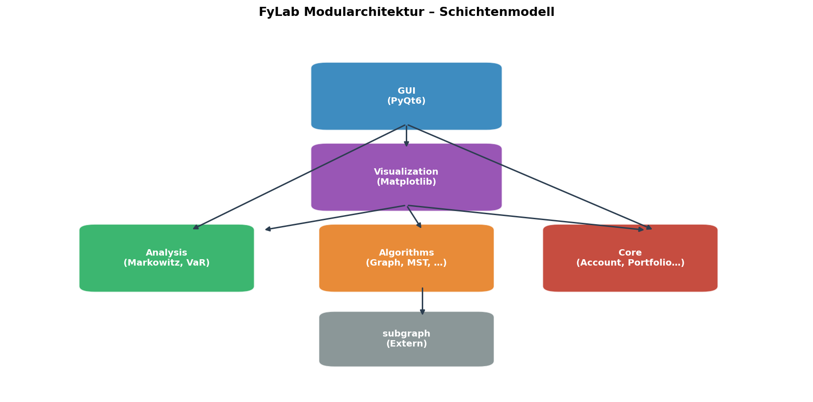

*Abbildung 1: Schichtenmodell von FyLab. Pfeile zeigen
Importabhängigkeiten. Die externe `subgraph`-Bibliothek wird
ausschließlich von `algorithms/` verwendet.*

```
src/fylab/
├── __init__.py              # Version + Metadaten
├── core/                    # Datenmodelle (kein Algorithmus)
│   ├── account.py           # Account, Transaction, AccountType
│   ├── cashflow.py          # CashflowPlan, CashflowItem, Frequency
│   ├── currency.py          # CurrencyConverter
│   └── portfolio.py         # Portfolio, Position, Asset, AssetClass
├── algorithms/              # Graphalgorithmen
│   ├── subgraph_finance.py  # subgraph_contains(), FraudPattern
│   ├── arbitrage.py         # detect_arbitrage(), Bellman-Ford
│   ├── max_flow.py          # compute_max_flow(), simplify_debts()
│   └── mst.py               # compute_portfolio_mst(), Kruskal
├── analysis/                # Quantitative Analyse
│   ├── risk.py              # VaR, CVaR, Monte-Carlo
│   └── portfolio_opt.py     # Markowitz-Effizienzgrenze
├── visualization/           # Matplotlib-Charts
│   ├── cashflow_chart.py
│   ├── graph_viz.py
│   └── portfolio_chart.py
└── gui/                     # PyQt6-Fenster und Widgets
    ├── main_window.py
    └── widgets/
        ├── account_widget.py
        ├── cashflow_widget.py
        ├── graph_widget.py
        ├── plot_widget.py
        ├── portfolio_widget.py
        └── risk_widget.py
```

### Designprinzipien

- **Keine zirkulären Importe**: `core` kennt weder `algorithms` noch
  `gui`.  `algorithms` kennt nicht `analysis`.
- **Zentraler Algorithmus**: `subgraph_contains(R, G)` in
  `subgraph_finance.py` ist der einzige Einstiegspunkt für alle
  Subgraph-Operationen im System.
- **Reine Matplotlib-Visualisierung**: `visualization/` nutzt kein
  NetworkX und erzeugt alle Graphdarstellungen mit reinen
  NumPy/Matplotlib-Primitiven.

---

## 4  Modul `core` – Grunddatenmodelle

Das `core`-Paket enthält ausschließlich Datenklassen und
Geschäftslogik ohne algorithmische Abhängigkeiten.

### 4.1  Konto und Transaktionen

**Datei**: `src/fylab/core/account.py`

#### Klassen

```python
class AccountType(Enum):
    CHECKING   = "Girokonto"
    SAVINGS    = "Sparkonto"
    INVESTMENT = "Depot"
    CREDIT     = "Kreditkonto"
    CASH       = "Bargeld"

class TransactionCategory(Enum):
    INCOME     = "Einnahme"
    EXPENSE    = "Ausgabe"
    INVESTMENT = "Investition"
    TRANSFER   = "Übertrag"
    TAX        = "Steuer"
    DIVIDEND   = "Dividende"
    INTEREST   = "Zinsen"
    FEE        = "Gebühr"

@dataclass
class Transaction:
    date: date
    amount: float          # positiv = Einnahme, negativ = Ausgabe
    description: str
    category: TransactionCategory
    account_id: str
    counter_party: Optional[str] = None
    tags: List[str] = field(default_factory=list)

@dataclass
class Account:
    account_id: str
    name: str
    account_type: AccountType
    currency: str = "EUR"
    initial_balance: float = 0.0
    transactions: List[Transaction] = field(default_factory=list)
```

#### Wichtige Methoden von `Account`

| Methode | Rückgabe | Beschreibung |
|---|---|---|
| `balance` | `float` | Aktueller Kontostand (initial + Summe Buchungen) |
| `add_transaction(t)` | `None` | Fügt eine Transaktion hinzu |
| `transactions_by_category(cat)` | `List[Transaction]` | Filtert nach Kategorie |
| `monthly_summary()` | `dict[str, dict]` | Monatliche Ein-/Ausgaben `{YYYY-MM: {income, expense}}` |

#### Beispiel

```python
from datetime import date
from fylab.core.account import Account, AccountType, Transaction, TransactionCategory

kto = Account("DE001", "Girokonto", AccountType.CHECKING, initial_balance=1_500.0)

kto.add_transaction(Transaction(
    date=date(2026, 3, 1), amount=3_200.0,
    description="Gehalt März", category=TransactionCategory.INCOME,
    account_id="DE001",
))
kto.add_transaction(Transaction(
    date=date(2026, 3, 2), amount=-850.0,
    description="Miete", category=TransactionCategory.EXPENSE,
    account_id="DE001",
))

print(f"Kontostand: {kto.balance:.2f} €")   # 3 850.00 €
print(kto.monthly_summary())
# {'2026-03': {'income': 3200.0, 'expense': 850.0}}
```

---

### 4.2  Cashflow-Planung

**Datei**: `src/fylab/core/cashflow.py`

Mit `CashflowItem` und `CashflowPlan` lassen sich geplante
Zahlungsströme mit beliebiger Wiederholungsfrequenz modellieren.

#### Frequenzen

```python
class Frequency(Enum):
    ONCE        = "einmalig"
    DAILY       = "täglich"
    WEEKLY      = "wöchentlich"
    MONTHLY     = "monatlich"
    QUARTERLY   = "vierteljährlich"
    YEARLY      = "jährlich"
```

#### Klassen

```python
@dataclass
class CashflowItem:
    name: str
    amount: float          # positiv = Einnahme, negativ = Ausgabe
    start_date: date
    frequency: Frequency
    end_date: date | None = None

    def occurrences(self, from_date, to_date) -> List[date]: ...

@dataclass
class CashflowPlan:
    name: str
    items: List[CashflowItem]

    def monthly_cashflow(self, year: int) -> dict[str, float]: ...
    def cumulative_cashflow(self, year: int) -> np.ndarray: ...
```

#### Cashflow-Wasserfall-Diagramm

Der Cashflow-Plan des Demo-Haushalts 2026 enthält Gehalt, Miete,
Lebensmittel, ETF-Sparplan, Jahresbonus und periodische Ausgaben.

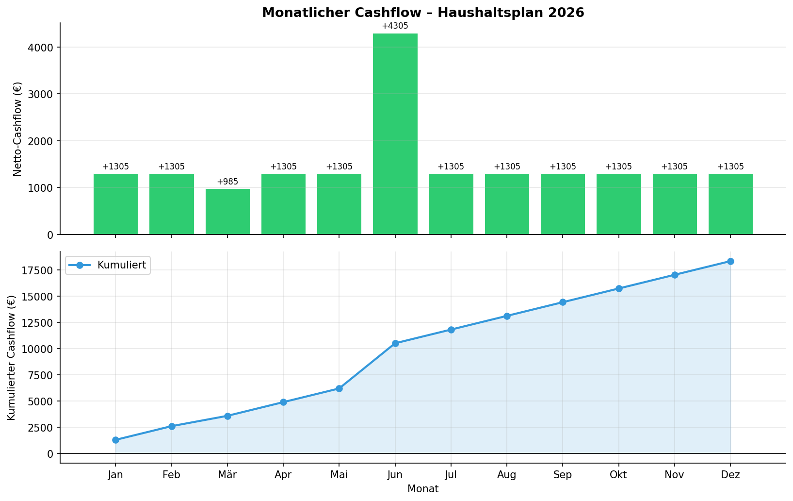

*Abbildung 2: Monatlicher Netto-Cashflow (oben) und kumulierter
Cashflow (unten) für den Haushaltsplan 2026.  Grüne Balken = positiver
Netto-Cashflow, roter Balken im März = Kfz-Steuer, Spike im Juni =
Jahresbonus.*

#### Beispiel

```python
from datetime import date
from fylab.core.cashflow import CashflowPlan, CashflowItem, Frequency

plan = CashflowPlan("Haushaltsplan 2026")
plan.items = [
    CashflowItem("Gehalt",       3200.0, date(2026, 1, 1), Frequency.MONTHLY, date(2026, 12, 31)),
    CashflowItem("Miete",        -850.0, date(2026, 1, 1), Frequency.MONTHLY, date(2026, 12, 31)),
    CashflowItem("ETF-Sparplan", -500.0, date(2026, 1, 1), Frequency.MONTHLY, date(2026, 12, 31)),
    CashflowItem("Jahresbonus", 3000.0,  date(2026, 6, 1), Frequency.ONCE),
    CashflowItem("Kfz-Steuer",  -320.0,  date(2026, 3, 1), Frequency.YEARLY),
]

monthly = plan.monthly_cashflow(2026)
print(monthly["2026-06"])   # 3200 - 850 - 500 + 3000 = 4850.0  (mit Bonus)

cum = plan.cumulative_cashflow(2026)
print(f"Jahresendstand: {cum[-1]:,.2f} €")
```

---

### 4.3  Portfolio und Assets

**Datei**: `src/fylab/core/portfolio.py`

#### Asset-Klassen

```python
class AssetClass(Enum):
    STOCK       = "Aktie"
    BOND        = "Anleihe"
    ETF         = "ETF"
    CRYPTO      = "Kryptowährung"
    REAL_ESTATE = "Immobilie"
    COMMODITY   = "Rohstoff"
    CASH        = "Liquidität"
```

#### Klassen

```python
@dataclass
class Asset:
    symbol: str
    name: str
    asset_class: AssetClass
    currency: str = "EUR"

@dataclass
class Position:
    asset: Asset
    quantity: float
    avg_buy_price: float
    current_price: float = 0.0

    # Properties
    market_value: float       # quantity * current_price
    book_value: float         # quantity * avg_buy_price
    profit_loss: float        # market_value - book_value
    profit_loss_pct: float    # G/V in Prozent

@dataclass
class Portfolio:
    name: str
    positions: List[Position]

    total_value: float
    total_profit_loss: float

    def weight(self, symbol: str) -> float: ...
    def weights_vector(self) -> np.ndarray: ...
    def asset_class_allocation(self) -> Dict[str, float]: ...
```

#### Asset-Allokation

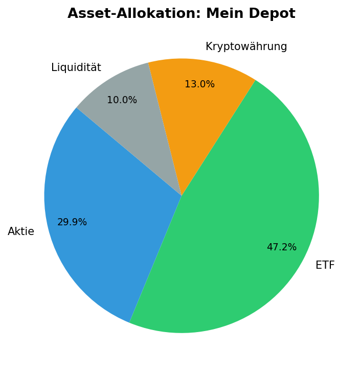

*Abbildung 3: Tortendiagramm der Asset-Allokation des Demo-Depots.
US-Tech-Aktien (MSFT, AAPL, NVDA) dominieren, gefolgt von
Europa-ETFs und einem kleinen Krypto-Anteil.*

#### Beispiel

```python
from fylab.core.portfolio import Portfolio, Position, Asset, AssetClass

pf = Portfolio("Mein Depot")
pf.positions = [
    Position(Asset("MSFT", "Microsoft", AssetClass.STOCK),
             quantity=5, avg_buy_price=380.0, current_price=420.0),
    Position(Asset("VWRL.L", "Vanguard All World", AssetClass.ETF),
             quantity=80, avg_buy_price=100.0, current_price=108.0),
]

print(f"Depotwert: {pf.total_value:,.2f} €")
print(f"G/V:       {pf.total_profit_loss:+,.2f} €")
print(pf.asset_class_allocation())
```

---

### 4.4  Währungskonverter

**Datei**: `src/fylab/core/currency.py`

`CurrencyConverter` verwaltet Wechselkurse relativ zu EUR und
konvertiert beliebige Beträge zwischen allen hinterlegten Währungen.

```python
from fylab.core.currency import CurrencyConverter

conv = CurrencyConverter()
print(conv.available_currencies)
# ['AUD', 'BTC', 'CAD', 'CHF', 'CNY', 'EUR', 'GBP', 'JPY', 'USD']

print(conv.convert(1000, "EUR", "USD"))   # 1085.0
print(conv.rate("USD", "JPY"))            # ≈ 150.4

conv.update_rate("CHF", 0.94)             # Kurs aktualisieren
```

Die Arbitrage-Analyse (→ Abschnitt 5.3) nutzt diese Kurse als
Eingabe für die Bellman-Ford-Erkennung.

---

## 5  Modul `algorithms` – Graphalgorithmen

Das `algorithms`-Paket enthält alle graphtheoretischen Algorithmen.
Alle vier Module verwenden gemeinsam die zentrale Funktion
`subgraph_contains(R, G)` aus `subgraph_finance.py`.

### 5.1  Subgraph-Isomorphismus (Kernalgorithmus)

**Datei**: `src/fylab/algorithms/subgraph_finance.py`

#### Theoretischer Hintergrund

Subgraph-Isomorphismus ist **NP-vollständig** im allgemeinen Fall
(Reduktion aus Clique).  FyLab nutzt den **Subgraph Algorithmus**
von Epp-Group, der durch *zyklische Spalten-Rotation* und
*polynomiale Hash-Signaturen* der Adjazenzmatrix eine praktisch
optimale Laufzeit von `O(n³)` erreicht.

```
Spalten-Signatur: σ(A)_j = Σ_i  A[i,j] · p_i^j   (p prim)
```

Zwei Spalten beziehungsweise Teilgraphen stimmen überein, wenn
ihre Signaturen übereinstimmen.

**Padding-Prinzip**: Da R und G unterschiedliche Knotenanzahlen
haben können, werden beide Matrizen vor dem Vergleich auf
`n_max = max(|V_R|, |V_G|)` mit Nullen aufgefüllt:

```
R_pad, G_pad ∈ {0,1}^(n_max × n_max)
```

#### Rückgabe-Entscheidungen

`Subgraph.compare_graphs(R, G)` gibt eine von fünf Entscheidungen
zurück:

| Entscheidung | Bedeutung | Muster erkannt? |
|---|---|---|
| `"keep_B"` | R ⊆ G | **Ja** |
| `"keep_A"` | G ⊆ R (kein Muster) | Nein |
| `"equal_keep_A"` | R = G | **Ja** |
| `"equal_keep_B"` | R = G | **Ja** |
| `"keep_both"` | weder R ⊆ G noch G ⊆ R | Nein |

#### Zentrale Utility-Funktion

```python
from fylab.algorithms.subgraph_finance import subgraph_contains

def subgraph_contains(
    R: np.ndarray,               # Referenz-/Mustergraph
    G: np.ndarray,               # Zu durchsuchender Graph
    use_adjacency_list: bool = False,
) -> tuple[bool, str]:
    """
    Prüft ob R als Subgraph in G enthalten ist.
    Rückgabe: (detected: bool, decision: str)
    """
```

#### Visualisierung des Algorithmus

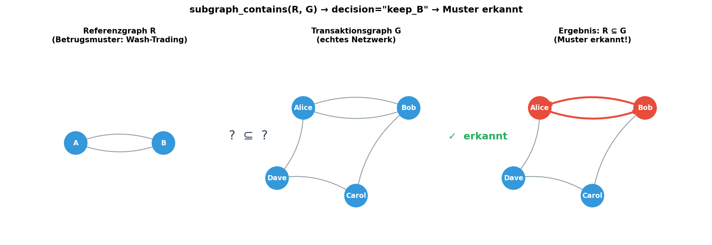

*Abbildung 4: Schematische Darstellung des Subgraph Algorithmus.
Links: Referenzgraph R (Wash-Trading-Muster A↔B).  Mitte:
Transaktionsgraph G mit eingebettetem Muster.  Rechts: Ergebnis –
Alice und Bob sind als Wash-Trading-Knoten markiert
(`decision="keep_B"`).*

#### Verwendung in allen vier Modulen

```
subgraph_finance.py  →  FRAUD_DETECT    ≤_p  SUBGRAPH_ISO
arbitrage.py         →  CYCLE_EXISTS    ≤_p  SUBGRAPH_ISO
max_flow.py          →  SCHULDEN_MUSTER ≤_p  SUBGRAPH_ISO
mst.py               →  STRUKTURVGL.    ≤_p  SUBGRAPH_ISO
```

---

### 5.2  Betrugserkennung

**Datei**: `src/fylab/algorithms/subgraph_finance.py`

#### Betrugsschemen und ihre Topologien

FyLab erkennt vier klassische Betrugsmuster als Subgraph-Referenzmatrizen R:

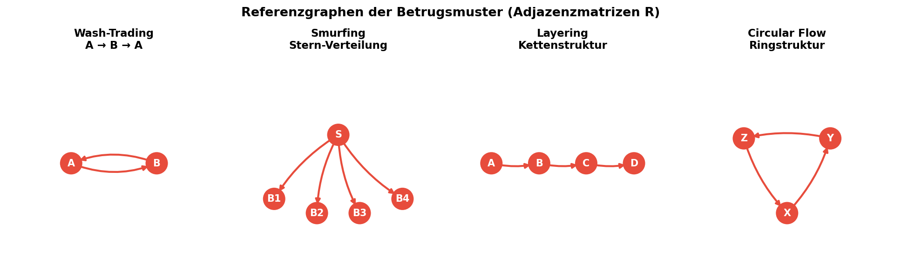

*Abbildung 5: Topologien der vier Betrugsmuster als gerichtete
Referenzgraphen R.  Von links: Wash-Trading (2-Zyklus),
Smurfing (Stern), Layering (Kette), Circular Flow (Ringstruktur).*

| Muster | Topologie | Adjazenzmatrix R | Beschreibung |
|---|---|---|---|
| **Wash-Trading** | A → B → A | 2×2 Zyklus | Scheinhandel zwischen zwei Konten |
| **Smurfing** | A → {B,C,D,E} | Stern (1→4) | Beträge auf viele kleine Transfers aufteilen |
| **Layering** | A → B → C → D | 4-Knoten-Kette | Verschleierung durch mehrere Zwischenstationen |
| **Circular Flow** | A → B → C → A | 3×3 Zyklus | Kreisförmiger Zahlungsfluss zur Tarnung |

#### Transaktionsgraph mit Betrugserkennung

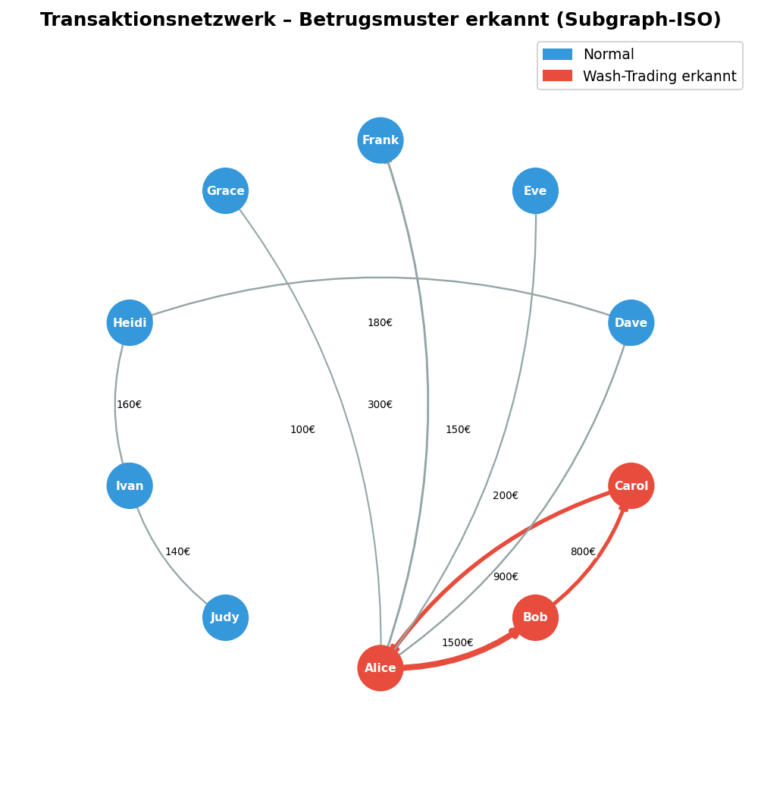

*Abbildung 6: Transaktionsnetzwerk mit erkanntem Wash-Trading-Zyklus
(rot: Alice–Bob–Carol).  Kantenstärke proportional zum
Transaktionsbetrag.  Gleichzeitig sichtbar: Smurfing (Alice → Dave,
Eve, Frank, Grace) und Layering-Kette (Dave → Heidi → Ivan → Judy).*

#### API

```python
from fylab.algorithms.subgraph_finance import (
    build_transaction_graph, detect_fraud_patterns, FraudPattern
)

# Transaktionen: (sender, receiver, betrag)
txns = [
    ("Alice", "Bob",   1500.0),
    ("Bob",   "Carol",  800.0),
    ("Carol", "Alice",  900.0),   # Zyklus → Wash-Trading
    ("Alice", "Dave",   200.0),
    ("Alice", "Eve",    150.0),
    ("Alice", "Frank",  300.0),
    ("Alice", "Grace",  100.0),   # Stern → Smurfing
    ("Dave",  "Heidi",  180.0),
    ("Heidi", "Ivan",   160.0),
    ("Ivan",  "Judy",   140.0),   # Kette → Layering
]

g = build_transaction_graph(txns)

# Alle Muster prüfen
results = detect_fraud_patterns(g)
for r in results:
    status = "ERKANNT" if r.detected else "nicht gefunden"
    print(f"[{status}] {r.pattern.value}  (decision={r.decision!r})")

# Ausgabe:
# [ERKANNT] Wash-Trading (Kreiszahlung)       (decision='keep_B')
# [ERKANNT] Smurfing (Sternverteilung)        (decision='keep_B')
# [ERKANNT] Layering (Kettenstruktur)         (decision='keep_B')
# [nicht gefunden] Kreisfluss (Ringstruktur)  (decision='keep_both')

# Nur bestimmte Muster prüfen
results = detect_fraud_patterns(g, [FraudPattern.WASH_TRADING])
```

---

### 5.3  Arbitrage-Erkennung (Bellman-Ford)

**Datei**: `src/fylab/algorithms/arbitrage.py`

#### Theoretischer Hintergrund

**Arbitrage** liegt vor, wenn ein Zyklus von Währungswechseln
einen Gewinn erzeugt:

```
r(i₀→i₁) · r(i₁→i₂) · ... · r(iₖ→i₀)  >  1
```

**Reduktion auf negativen Zyklus**:
Logarithmische Transformation `w(i→j) = -log(r(i→j))` wandelt
das Produkt in eine Summe um:

```
Produkt > 1  ⟺  Summe der w   <  0  ⟺  negativer Zyklus
```

#### Zweistufiger Algorithmus

```
Stufe 1 – Subgraph-Vorprüfung  O(n³):
  Enthält der Konnektivitätsgraph überhaupt einen k-Zyklus?
  Falls nicht: sofortige Rückgabe → kein Bellman-Ford nötig.

Stufe 2 – Bellman-Ford  O(V·E):
  Exakte Negativzyklus-Erkennung mit logarithmisch transformierten
  Kantengewichten.
```

**Theoretische Einordnung**:
```
ARBITRAGE ≤_p NEG_CYCLE ≤_p BELLMAN_FORD
     und
CYCLE_EXISTS ≤_p SUBGRAPH_ISO  (Vorfilter, O(n³))
```

#### Währungsgraph mit Arbitrage-Zyklus

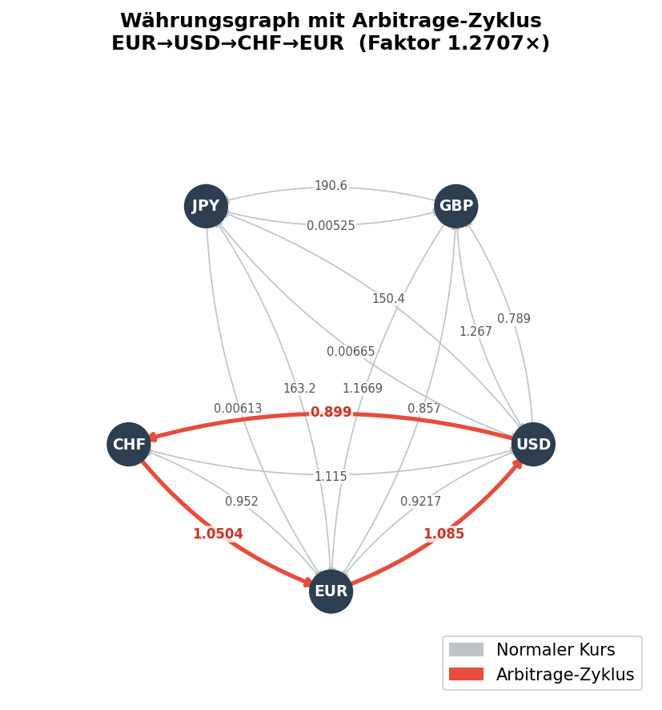

*Abbildung 7: Währungsgraph mit fünf Währungen.  Der rote Pfad
EUR → USD → CHF → EUR ergibt einen Arbitrage-Faktor > 1
(Produkt der Kurse).  Grau dargestellte Kanten sind normale
Wechselkurse ohne Arbitrage-Potenzial.*

#### k-Zyklus-Referenzmatrizen

```python
CYCLE_PATTERN_MATRICES = {
    CyclePattern.CYCLE_2: np.array([[0,1],[1,0]]),
    CyclePattern.CYCLE_3: np.array([[0,1,0],[0,0,1],[1,0,0]]),
    CyclePattern.CYCLE_4: np.array([[0,1,0,0],[0,0,1,0],[0,0,0,1],[1,0,0,0]]),
    CyclePattern.CYCLE_5: np.array([[0,1,0,0,0],[0,0,1,0,0],[0,0,0,1,0],
                                     [0,0,0,0,1],[1,0,0,0,0]]),
}
```

#### API

```python
from fylab.algorithms.arbitrage import (
    detect_arbitrage, detect_cycle_patterns, CyclePattern
)

currencies = ["EUR", "USD", "GBP", "JPY", "CHF"]
rates = {
    ("EUR", "USD"): 1.085,  ("USD", "EUR"): 0.9217,
    ("EUR", "GBP"): 0.857,  ("GBP", "EUR"): 1.1669,
    ("EUR", "CHF"): 0.952,  ("CHF", "EUR"): 1.0504,
    ("USD", "CHF"): 0.899,  ("CHF", "USD"): 1.115,
    # ... weitere Kurse
}

# Stufe 1: Strukturelle Vorprüfung
cycle_checks = detect_cycle_patterns(currencies, rates)
for c in cycle_checks:
    print(f"{c.pattern.value}: {'✓' if c.detected else '–'}")

# Vollständige Arbitrage-Analyse (beide Stufen)
result = detect_arbitrage(currencies, rates)
print(result)
# "Arbitrage: EUR → USD → CHF → EUR  (Faktor: 1.2719x)"
# oder
# "Keine Arbitrage-Möglichkeit gefunden."

if result.has_arbitrage:
    print(f"Zyklus:  {' → '.join(result.cycle)}")
    print(f"Gewinn:  {(result.profit_factor - 1) * 100:.2f}%")
```

---

### 5.4  Schuldenausgleich & Max-Flow (Edmonds-Karp)

**Datei**: `src/fylab/algorithms/max_flow.py`

#### Schuldenmuster-Analyse via Subgraph

Vor dem Greedy-Schuldenausgleich analysiert FyLab die Schuldenstruktur
auf bekannte Muster:

| Muster | Topologie | Bedeutung |
|---|---|---|
| **Dreieck-Schuld** | A → B → C → A | Gegenseitige Verrechnung möglich |
| **Hub-Schuldner** | A → B, A → C, A → D | Sammeltransaktion empfohlen |
| **Hub-Gläubiger** | B → A, C → A, D → A | Direkte Auszahlung |
| **Schulden-Kette** | A → B → C → D | Indirekte Weiterleitung möglich |

#### Greedy Schuldenausgleich

```
Nettosaldo:  b_i = Σ_j a(j→i) − Σ_j a(i→j)

b_i > 0  →  Gläubiger
b_i < 0  →  Schuldner

Greedy-Matching: O(n log n)
```

**Hinweis**: Minimierung der *Transaktionsanzahl* ist NP-hart
(Reduktion aus PARTITION).  Greedy minimiert nur den Nettosaldo.

#### Visualisierung: Vor/Nach Vereinfachung

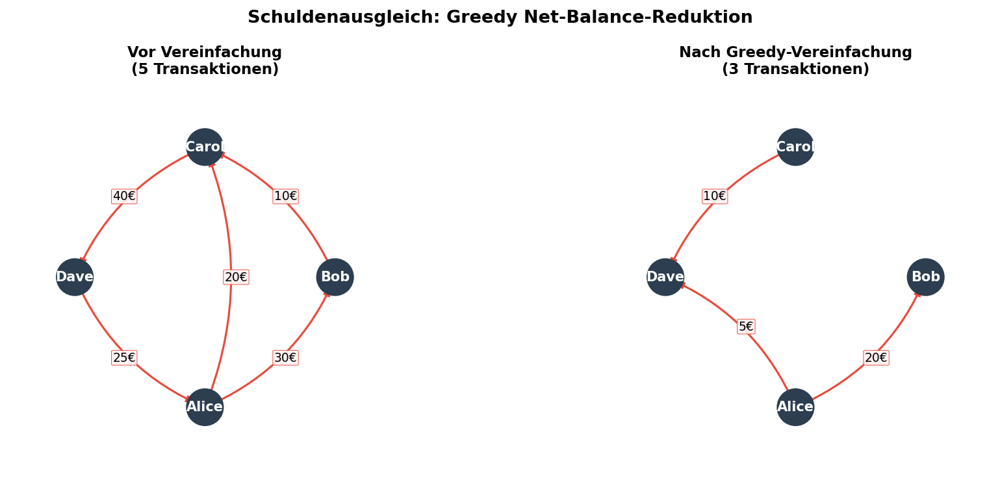

*Abbildung 8: Links: ursprünglicher Schuldengraph mit fünf
Transaktionen (Alice–Bob–Carol–Dave-Zyklus).  Rechts: nach
Greedy-Nettobalanzierung reduziert auf drei Transaktionen.
Alle Schulden werden beglichen, aber mit minimaler Transaktionsanzahl
durch einfache Nettosaldo-Berechnung.*

#### Max-Flow im Cashflow-Netzwerk

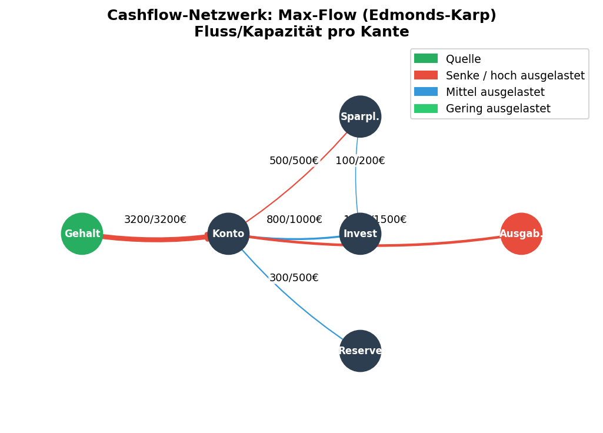

*Abbildung 9: Cashflow-Netzwerk mit Edmonds-Karp Max-Flow.
Kantenbeschriftung: Fluss/Kapazität.  Farbe zeigt Auslastung
(grün = gering, blau = mittel, rot = hoch ausgelastet).
Quelle: Gehaltskonto, Senke: Ausgaben.*

#### API

```python
from fylab.algorithms.max_flow import (
    compute_max_flow, simplify_debts, detect_debt_patterns, DebtPattern
)

# Max-Flow zwischen Konten
graph = {
    "Gehalt":   {"Konto": 3200},
    "Konto":    {"Sparplan": 500, "Invest": 1000, "Ausgaben": 1500},
    "Sparplan": {"Invest": 200},
}
result = compute_max_flow(graph, source="Gehalt", sink="Invest")
print(result)   # Max-Flow = 1200.00

# Schulden vereinfachen
debts = [
    ("Alice", "Bob",   30.0),
    ("Alice", "Carol", 20.0),
    ("Bob",   "Carol", 10.0),
    ("Carol", "Dave",  40.0),
    ("Dave",  "Alice", 25.0),
]

# Schuldenmuster analysieren
patterns = detect_debt_patterns(debts)
for p in patterns:
    if p.detected:
        print(f"Muster erkannt: {p.pattern.value}")
# Muster erkannt: Dreieck-Schuld (3-Zyklus)

# Vereinfachung
transactions = simplify_debts(debts)
for t in transactions:
    print(t)
# Alice zahlt 25.00€ an Dave   (aufgehobene Zyklus-Schuld)
# Alice zahlt 20.00€ an Carol
# Bob zahlt 10.00€ an Carol
```

---

### 5.5  Portfolio-Diversifikation via MST (Kruskal)

**Datei**: `src/fylab/algorithms/mst.py`

#### Theoretischer Hintergrund

Die **Pearson-Distanzmetrik** transformiert Korrelationen in
Kantengewichte, die für den MST verwendet werden:

```
d(i, j) = √(2 · (1 − ρ_ij))   ∈  [0, 2]
```

- `d = 0` → vollständig positiv korreliert
- `d = 2` → vollständig negativ korreliert

**Kruskal-Algorithmus** mit Union-Find (Pfadkompression + Union-by-Rank):
- Alle Kanten nach Gewicht sortieren: `O(n² log n)`
- Union-Find-Operationen: nahezu `O(1)` amortisiert

**Cluster-Bildung**: Kanten mit Gewicht ≤ Median = "starke
Abhängigkeiten" definieren die Cluster ähnlicher Assets.

#### Portfolio-MST

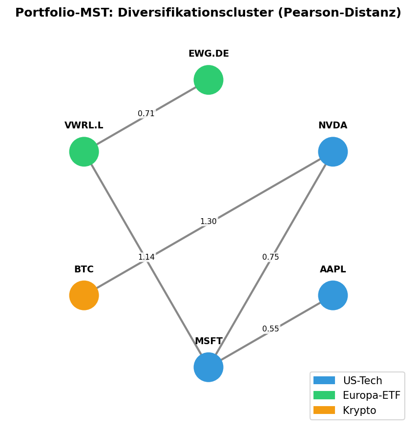

*Abbildung 10: Minimum Spanning Tree des Demo-Portfolios basierend auf
der Pearson-Distanzmatrix.  US-Tech-Aktien (blau: MSFT, AAPL, NVDA)
bilden einen engen Cluster mit geringen Kantendistanzen.
Europa-ETFs (grün: EWG.DE, VWRL.L) bilden einen zweiten Cluster.
Bitcoin (orange) ist strukturell isoliert – ideal für Diversifikation.*

#### Portfoliovergleich via Subgraph-ISO

```python
from fylab.algorithms.mst import compare_portfolio_structures

# Binärkodierung: adj[i,j] = 1 falls |corr[i,j]| > threshold
result = compare_portfolio_structures(
    symbols_a, corr_a,      # Portfolio A
    symbols_b, corr_b,      # Portfolio B
    threshold=0.5,           # Schwelle für starke Korrelation
)
print(result.description)
# "A ist strukturell in B enthalten
#  (B hat Superset der Abhängigkeiten)"
```

#### API

```python
from fylab.algorithms.mst import compute_portfolio_mst, MSTResult

symbols = ["MSFT", "AAPL", "NVDA", "EWG.DE", "VWRL.L", "BTC"]
corr = np.array([...])   # 6×6 Korrelationsmatrix

mst: MSTResult = compute_portfolio_mst(symbols, corr)

print(f"MST Gesamtgewicht: {mst.total_weight:.3f}")
print(f"Cluster: {mst.clusters}")
# Cluster: [['MSFT','AAPL','NVDA'], ['EWG.DE','VWRL.L'], ['BTC']]

# Diversifiziertes Portfolio: einen Repräsentanten pro Cluster wählen
diversified = [cluster[0] for cluster in mst.clusters]
print(diversified)   # ['MSFT', 'EWG.DE', 'BTC']
```

---

## 6  Modul `analysis` – Risikoanalyse & Portfolio-Optimierung

### 6.1  Value-at-Risk und CVaR

**Datei**: `src/fylab/analysis/risk.py`

#### Definitionen

| Kennzahl | Definition | Formel |
|---|---|---|
| **VaR(α)** | Maximaler Verlust mit Wahrsch. α über Haltedauer | −Quantil(r, 1−α) |
| **CVaR(α)** | Erwarteter Verlust im schlimmsten (1−α)-Tail | E[−r \| r ≤ −VaR(α)] |
| **Max-Drawdown** | Maximaler relativer Rückgang vom Höchststand | max((peak−price)/peak) |
| **Sharpe-Ratio** | Risikoadjustierte Rendite | (μ_p − r_f) / σ_p |
| **Volatilität (p.a.)** | Jährliche Standardabweichung | σ_daily · √252 |

#### Renditeverteilung mit VaR/CVaR

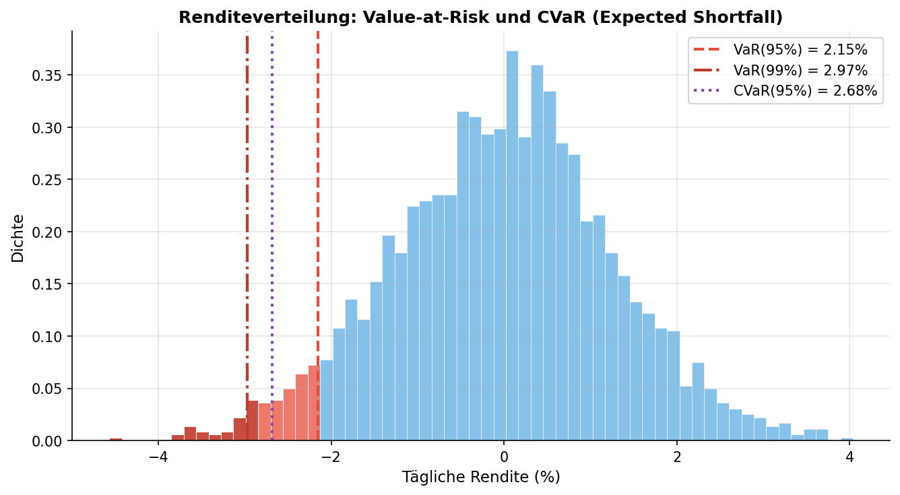

*Abbildung 11: Histogramm der täglichen Renditeverteilung
(μ=8% p.a., σ=20% p.a., 2520 Handelstage / 10 Jahre).  Rot: VaR(95%),
Dunkelrot: VaR(99%), Lila: CVaR(95%).  Der CVaR liegt immer links
vom VaR, da er den Erwartungswert des Verlust-Tails misst.*

#### API

```python
import numpy as np
from fylab.analysis.risk import compute_risk_metrics, monte_carlo_portfolio

# Historische tägliche Renditen (aus Preisreihe berechnen)
prices = np.array([100, 102, 98, 105, 103, ...])
returns = np.diff(np.log(prices))

# Alle Risikomaße auf einmal
metrics = compute_risk_metrics(returns, risk_free_rate=0.03)
print(metrics)
# VaR(95%)=1.23%  VaR(99%)=1.87%  CVaR(95%)=1.54%
# MaxDD=12.34%  Vol=19.87%  Sharpe=0.81

# Einzelne Kennzahlen
from fylab.analysis.risk import (
    compute_var_historical, compute_cvar_historical, compute_max_drawdown
)

var_95  = compute_var_historical(returns, confidence=0.95)
cvar_95 = compute_cvar_historical(returns, confidence=0.95)
max_dd  = compute_max_drawdown(np.cumprod(1 + returns))
```

---

### 6.2  Monte-Carlo-Simulation

**Datei**: `src/fylab/analysis/risk.py`

Die Monte-Carlo-Simulation modelliert `n_simulations` Portfoliopfade
über `n_days` Handelstage unter der Annahme normalverteilter
täglicher Renditen:

```
P_t = P_{t-1} · (1 + r_t),   r_t ~ N(μ_daily, σ_daily)
```

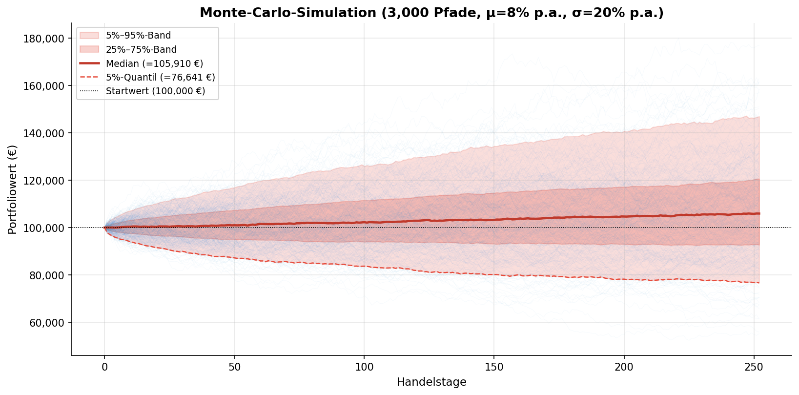

*Abbildung 12: Monte-Carlo-Simulation mit 3.000 Pfaden
(μ=8% p.a., σ=20% p.a., Startwert 100.000 €).  Hellblaue Pfade:
einzelne Simulationen.  Dunkelrote Linie: Median-Pfad.  Rote Fläche:
5%–95%-Konfidenzband.  Das 5%-Quantil nach einem Jahr (gestrichelt)
gibt den schlechtesten Verlauf an, mit dem in 95% der Fälle
nicht zu rechnen ist.*

#### API

```python
from fylab.analysis.risk import monte_carlo_portfolio

# Portfolio: gleichgewichtet auf 3 Assets
weights       = np.array([0.4, 0.4, 0.2])
mean_returns  = np.array([0.10, 0.08, 0.15])   # p.a.
cov_matrix    = np.array([[0.04, 0.01, 0.005],
                           [0.01, 0.03, 0.003],
                           [0.005,0.003,0.08]])

sims = monte_carlo_portfolio(
    weights, mean_returns, cov_matrix,
    n_simulations=10_000,
    n_days=252,
    initial_value=100_000.0,
    seed=42,
)
# sims.shape == (10_000, 253)  — t=0 bis t=252

final_values = sims[:, -1]
print(f"Median Endwert:  {np.median(final_values):,.0f} €")
print(f"5%-Quantil:      {np.percentile(final_values, 5):,.0f} €")
print(f"95%-Quantil:     {np.percentile(final_values, 95):,.0f} €")
```

---

### 6.3  Markowitz-Effizienzgrenze

**Datei**: `src/fylab/analysis/portfolio_opt.py`

Die **Effizienzgrenze** nach Markowitz (1952) beschreibt alle
Portfolios, die für eine gegebene Zielrendite die minimale
Volatilität aufweisen.

```
min   w^T Σ w
s.t.  w^T μ = μ_target
      Σ w_i = 1
      w_i ≥ 0
```

Gelöst via **SLSQP** (Sequential Least-Squares Programming) aus
`scipy.optimize.minimize`.  Das **Sharpe-optimale Portfolio**
maximiert `(μ_p − r_f) / σ_p`.

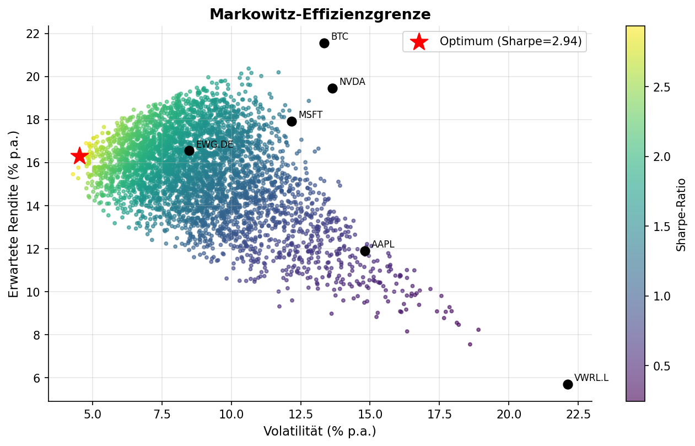

*Abbildung 13: Markowitz-Effizienzgrenze des Demo-Portfolios (4.000
zufällige Portfolios).  Farbe = Sharpe-Ratio.  Roter Stern =
Sharpe-optimales Portfolio.  Schwarze Punkte = Einzelassets.
Die Effizienzgrenze (obere Hülle) zeigt alle Pareto-optimalen
Portfolios.*

#### API

```python
from fylab.analysis.portfolio_opt import compute_efficient_frontier

symbols        = ["MSFT", "AAPL", "NVDA", "EWG.DE", "VWRL.L", "BTC"]
expected_ret   = np.array([0.12, 0.10, 0.18, 0.06, 0.07, 0.20])
cov_matrix     = np.array([...])   # 6×6 geschätzte Kovarianzmatrix

result = compute_efficient_frontier(
    symbols, expected_ret, cov_matrix,
    risk_free_rate=0.03,
    n_points=100,
)

print(f"Sharpe-Optimum:")
print(f"  Rendite:    {result.optimal_return:.2%}")
print(f"  Volatilität:{result.optimal_volatility:.2%}")
print(f"  Sharpe:     {result.optimal_sharpe:.2f}")
print(f"  Gewichte:   {dict(zip(symbols, result.optimal_weights))}")
```

---

## 7  Modul `visualization` – Diagramme und Graphen

Das `visualization`-Paket erzeugt alle Diagramme als
`matplotlib.figure.Figure`-Objekte, die entweder direkt in der GUI
über `PlotWidget` angezeigt oder in Dateien gespeichert werden können.

**Wichtig**: Das gesamte Paket verwendet kein NetworkX.  Alle
Graphvisualisierungen werden mit reinen Matplotlib-Primitiven
(Patches, Annotate-Pfeile, Kreise) gezeichnet.

### Übersicht der Plot-Funktionen

| Funktion | Modul | Beschreibung |
|---|---|---|
| `plot_cashflow_waterfall(plan, year)` | `cashflow_chart` | Wasserfall + kumulierter Cashflow |
| `plot_income_expense(account)` | `cashflow_chart` | Einnahmen vs. Ausgaben Balken |
| `plot_asset_allocation(portfolio)` | `portfolio_chart` | Tortendiagramm Asset-Klassen |
| `plot_efficient_frontier(result, ...)` | `portfolio_chart` | Markowitz-Effizienzgrenze |
| `plot_transaction_graph(graph, ...)` | `graph_viz` | Transaktionsnetzwerk mit Betrugsmarkierung |
| `plot_portfolio_mst(mst_result, ...)` | `graph_viz` | MST mit Cluster-Färbung |
| `plot_risk_monte_carlo(simulations, ...)` | `graph_viz` | Monte-Carlo-Pfade mit Quantilbändern |

### Verwendungsbeispiel

```python
import matplotlib.pyplot as plt
from fylab.visualization.cashflow_chart import plot_cashflow_waterfall
from fylab.visualization.graph_viz import plot_transaction_graph

# Figure erzeugen
fig = plot_cashflow_waterfall(plan, year=2026)

# Speichern als PNG / SVG / PDF
fig.savefig("cashflow.png", dpi=150)
fig.savefig("cashflow.svg", bbox_inches="tight")
fig.savefig("cashflow.pdf", bbox_inches="tight")

# Oder direkt anzeigen
plt.show()
```

### Kreislayout-Algorithmus

`graph_viz.py` implementiert ein deterministisches **Kreislayout**:
Knoten werden gleichmäßig auf einem Einheitskreis verteilt,
Start oben (Offset −π/2).  Kanten werden als gebogene Pfeile
(`arc3,rad=0.15`) gezeichnet, um Überlappungen bei bidirektionalen
Kanten zu vermeiden.

```python
def _circular_layout(nodes, radius=1.0):
    offset = -math.pi / 2
    return {
        node: (radius * cos(2π·i/n + offset),
               radius * sin(2π·i/n + offset))
        for i, node in enumerate(nodes)
    }
```

---

## 8  Modul `gui` – Grafische Benutzeroberfläche

### 8.1  Hauptfenster

**Datei**: `src/fylab/gui/main_window.py`

Das `MainWindow` gliedert sich in:

```
┌──────────────────────────────────────────────────────────────┐
│  Menüleiste (Datei | Analyse | Hilfe)                        │
│  Toolbar (Konto | Portfolio | Cashflow | Graphanalyse | Risiko)│
├──────────────┬───────────────────────────────────────────────┤
│              │  Tabs:                                        │
│  Dock-Panel  │   0  Konto       (AccountWidget)              │
│  (Module-    │   1  Portfolio   (PortfolioWidget)            │
│   Baum)      │   2  Cashflow    (CashflowWidget)             │
│              │   3  Graphanalyse(GraphWidget)                │
│              │   4  Risikoanalyse(RiskWidget)                │
├──────────────┴───────────────────────────────────────────────┤
│  Statusleiste  FyLab 1.0.0 – Stephan Epp                    │
└──────────────────────────────────────────────────────────────┘
```

#### Navigation

Drei Wege für schnelle Navigation:

1. **Toolbar-Buttons**: Konto / Portfolio / Cashflow / Graphanalyse / Risiko
2. **Menü „Analyse"**: Betrugserkennung, Arbitrage, Risiko, Effizienzgrenze
3. **Dock-Baum links**: Klick auf Modulname öffnet den zugehörigen Tab

#### Keyboard-Shortcuts

| Shortcut | Aktion |
|---|---|
| `Ctrl+N` | Neues Projekt |
| `Ctrl+Q` | Beenden |

---

### 8.2  AccountWidget

**Datei**: `src/fylab/gui/widgets/account_widget.py`

Zeigt Kontostände, Buchungshistorie und monatliche
Einnahmen/Ausgaben.  Transaktionen werden nach Kategorie
eingefärbt (grün = Einnahme, rot = Ausgabe).

**Funktionen**:
- Tabellarische Übersicht aller Transaktionen mit Datum, Betrag,
  Beschreibung, Kategorie
- Monatliche Zusammenfassung als Einnahmen/Ausgaben-Balkendiagramm
- Filter nach Kategorie (`TransactionCategory`)

---

### 8.3  PortfolioWidget

**Datei**: `src/fylab/gui/widgets/portfolio_widget.py`

Vier Tabs:

| Tab | Inhalt |
|---|---|
| **Positionen** | Tabelle: Symbol, Name, Klasse, Menge, Kurs, Wert, G/V (%) |
| **Allokation** | Tortendiagramm der Asset-Klassen-Gewichte |
| **Effizienzgrenze** | Markowitz-Kurve auf Knopfdruck berechnen |
| **MST Diversifikation** | Kruskal-MST mit Cluster-Färbung |

Die Kopfzeile zeigt den Gesamtwert und den absoluten G/V permanent an.

---

### 8.4  CashflowWidget

**Datei**: `src/fylab/gui/widgets/cashflow_widget.py`

| Tab | Inhalt |
|---|---|
| **Posten** | Tabelle: Name, Betrag (+/-), Frequenz, Von, Bis |
| **Cashflow-Chart** | Wasserfall-Diagramm (automatisch bei Jahreswechsel aktualisiert) |

Der **„+ Posten"**-Button öffnet einen Dialog zum Hinzufügen neuer
Zahlungsposten (Name, Betrag, Frequenz, Startdatum).

Das Jahres-SpinBox-Widget wechselt den angezeigten Zeitraum und
aktualisiert Chart und Summe automatisch über `valueChanged`.

---

### 8.5  GraphWidget

**Datei**: `src/fylab/gui/widgets/graph_widget.py`

Drei Analyse-Tabs:

#### Tab „Betrugserkennung"

- Startet Subgraph-ISO-Analyse auf Demo-Transaktionsdaten
- Zeigt Erkennungsergebnis pro Muster als Textzusammenfassung
- Visualisiert Transaktionsgraph mit rot markierten Betrugsknoten

```
🔴 ERKANNT: Wash-Trading (Kreiszahlung)
🔴 ERKANNT: Smurfing (Sternverteilung)
🔴 ERKANNT: Layering (Kettenstruktur)
✅ nicht gefunden: Kreisfluss (Ringstruktur)
```

#### Tab „Arbitrage"

- Zweistufige Analyse (Subgraph-Vorprüfung + Bellman-Ford) auf
  EUR/USD/GBP/JPY/CHF-Kurse
- Demo enthält einen absichtlich eingebauten Arbitrage-Zyklus
- Ergebnis-Textfeld mit Zyklusbeschreibung und Gewinnfaktor

#### Tab „Schuldenausgleich"

- Greedy-Nettobalanzierung auf Demo-Schuldenliste (Alice, Bob, Carol, Dave)
- Ergebnis als Tabelle: Zahler, Empfänger, Betrag (rot eingefärbt)

---

### 8.6  RiskWidget

**Datei**: `src/fylab/gui/widgets/risk_widget.py`

Zwei Analyse-Tabs:

#### Tab „VaR / CVaR"

Einstellbare Parameter:

| Parameter | Bereich | Standard |
|---|---|---|
| Erwartete Rendite | −50% … +50% p.a. | 8% |
| Volatilität | 1% … 100% p.a. | 20% |
| Risikofreier Zins | 0% … 20% p.a. | 3% |

Angezeigt werden: VaR(95%), VaR(99%), CVaR(95%), Max. Drawdown,
Volatilität p.a., Sharpe-Ratio (grün ≥1, rot <1).

#### Tab „Monte-Carlo"

| Parameter | Bereich | Standard |
|---|---|---|
| Simulationen | 100 … 50.000 | 10.000 |
| Startwert | 1.000 € … 10 Mio. € | 100.000 € |

Der „Monte-Carlo starten"-Button erzeugt die Simulation und rendert
das Diagramm mit Median, Quantilbändern (5%/25%/75%/95%) und
einzelnen Pfaden direkt im integrierten `PlotWidget`.

---

## 9  Theoretischer Hintergrund: Finanzprobleme als Graphprobleme

Dieser Abschnitt fasst die zentralen algorithmischen Reduktionen
zusammen, die FyLab zugrunde liegen.

### 9.1  Subgraph-Isomorphismus

```
Definition: Seien G = (V_G, E_G) und R = (V_R, E_R) gerichtete Graphen.
R ist subgraph-isomorph zu G, geschrieben R ⊆ G,
wenn eine injektive Abbildung f: V_R → V_G existiert mit:

    (u, v) ∈ E_R  ⟹  (f(u), f(v)) ∈ E_G   ∀ u,v ∈ V_R

Theorem: Subgraph-Isomorphismus ist NP-vollständig.
Beweis: Das Cliquen-Problem ist ein Spezialfall (K_k ⊆ G).
```

FyLab löst Subgraph-ISO nicht durch exponentielles Backtracking
(VF2), sondern durch den **Subgraph Algorithmus** mit `O(n³)`.

### 9.2  FRAUD_DETECT ≤_p SUBGRAPH_ISO

```
Konstruktion (O(n²)):
  1. Jede Transaktion (s, r, w) → Kante s→r in Adjazenzmatrix A_G
  2. Betrugsmuster → binäre Referenzmatrix A_R
  3. Betrug erkannt  ⟺  subgraph_contains(A_R, A_G) = True
```

### 9.3  ARBITRAGE ≤_p NEG_CYCLE ≤_p BELLMAN_FORD

```
Transformation (O(E)):  w(i→j) = −log(r_{ij})
Produkt > 1  ⟺  Σ w < 0  ⟺  negativer Zyklus

Vorfilter:  CYCLE_EXISTS ≤_p SUBGRAPH_ISO  (O(n³))
  → Bei azyklischem Konnektivitätsgraph: sofortige Rückgabe
```

### 9.4  DEBT_SIMPLIFY ≤_p NET_BALANCE

```
Nettosaldo:  b_i = Σ_j a(j→i) − Σ_j a(i→j)
Greedy:      Sortiere Gläubiger ↓ und Schuldner ↓, matche paarweise
Komplexität: O(n log n)

Hinweis: Minimale Transaktionsanzahl ist NP-hart (≤_p PARTITION).
```

### 9.5  PORTFOLIO_DIVERSIF ≤_p MST

```
Pearson-Distanz:  d(i,j) = √(2(1 − ρ_{ij}))
MST (Kruskal):    identifiziert Cluster ähnlicher Assets
Diversifikation:  wähle einen Repräsentanten pro Cluster
```

### 9.6  PORTFOLIO_SELECT ≤_p KNAPSACK

```
Assets:  Rendite r_i (Nutzen), Kapital p_i (Gewicht)
Budget:  K (Kapazität)
FPTAS:   (1−ε)-Approximation in O(n · K/ε)
```

### 9.7  STEUER_OPT ≤_p SUBSET_SUM

```
Ausgaben a_1,...,a_n, absetzbares Budget B.
Teilmenge S ⊆ [n] mit Σ_{i∈S} a_i ≤ B und Σ maximieren.
DP-Lösung: O(nB) pseudopolynomiell.
```

---

## 10  Vollständige Python-Beispiele

### Beispiel 1: Vollständige Portfolio-Analyse

```python
import numpy as np
from fylab.core.portfolio import Portfolio, Position, Asset, AssetClass
from fylab.analysis.portfolio_opt import compute_efficient_frontier, compute_diversification_mst
from fylab.analysis.risk import compute_risk_metrics, monte_carlo_portfolio
from fylab.visualization.portfolio_chart import plot_asset_allocation, plot_efficient_frontier
from fylab.visualization.graph_viz import plot_portfolio_mst, plot_risk_monte_carlo

# ── Portfolio aufbauen ────────────────────────────────────────
pf = Portfolio("Beispieldepot")
assets_data = [
    ("MSFT", "Microsoft",          AssetClass.STOCK,  5,  380, 420),
    ("AAPL", "Apple",              AssetClass.STOCK,  15, 170, 185),
    ("VWRL", "Vanguard All World", AssetClass.ETF,    80, 100, 108),
    ("BTC",  "Bitcoin",            AssetClass.CRYPTO, 0.05, 45000, 65000),
]
for sym, name, cls, qty, buy, cur in assets_data:
    pf.positions.append(Position(Asset(sym, name, cls), qty, buy, cur))

print(f"Depotwert: {pf.total_value:,.0f} €")
print(f"G/V:       {pf.total_profit_loss:+,.0f} €")

# ── Allokation ────────────────────────────────────────────────
fig_alloc = plot_asset_allocation(pf)
fig_alloc.savefig("allokation.svg")

# ── Effizienzgrenze ───────────────────────────────────────────
rng = np.random.default_rng(42)
n = len(pf.positions)
symbols   = [p.asset.symbol for p in pf.positions]
exp_ret   = rng.uniform(0.05, 0.20, n)
A         = rng.standard_normal((n, n))
cov       = A @ A.T / n * 0.04

ef = compute_efficient_frontier(symbols, exp_ret, cov)
print(f"Optimale Sharpe: {ef.optimal_sharpe:.2f}")

fig_ef = plot_efficient_frontier(ef, symbols, np.sqrt(np.diag(cov)), exp_ret)
fig_ef.savefig("effizienzgrenze.pdf")

# ── MST-Diversifikation ───────────────────────────────────────
corr = A @ A.T
np.fill_diagonal(corr, 1.0)
corr = np.clip(corr / corr.max(), -0.99, 0.99)

mst = compute_diversification_mst(symbols, corr)
print(f"Cluster: {mst.clusters}")

fig_mst = plot_portfolio_mst(mst)
fig_mst.savefig("mst.svg")

# ── Monte-Carlo-Risiko ────────────────────────────────────────
weights = np.ones(n) / n
sims = monte_carlo_portfolio(weights, exp_ret, cov,
                              n_simulations=5_000, initial_value=pf.total_value)

metrics = compute_risk_metrics(np.diff(np.log(sims[:, -1] / sims[:, 0])))
print(metrics)

fig_mc = plot_risk_monte_carlo(sims, "Portfolio Monte-Carlo")
fig_mc.savefig("monte_carlo.pdf")
```

---

### Beispiel 2: Betrugserkennung in Transaktionsdaten

```python
from fylab.algorithms.subgraph_finance import (
    build_transaction_graph, detect_fraud_patterns, FraudPattern
)
from fylab.visualization.graph_viz import plot_transaction_graph

# Transaktionsdaten laden (real oder demo)
txns = [
    ("Konto_A", "Konto_B", 50_000),
    ("Konto_B", "Konto_A", 49_800),  # Wash-Trading: nahezu gleicher Betrag
    ("Konto_A", "Konto_C",  5_000),
    ("Konto_A", "Konto_D",  5_100),
    ("Konto_A", "Konto_E",  4_900),
    ("Konto_A", "Konto_F",  5_050),  # Smurfing: 4 kleine Ausgänge
]

g = build_transaction_graph(txns)

# Alle Muster prüfen
results = detect_fraud_patterns(g)
detected = [r for r in results if r.detected]

if detected:
    print(f"⚠️  {len(detected)} Betrugsmuster erkannt!")
    for r in detected:
        print(f"   • {r.pattern.value} (Subgraph-Entscheidung: {r.decision!r})")
else:
    print("✅ Keine Anzeichen von Betrug gefunden.")

# Visualisierung
fig = plot_transaction_graph(g, results, "Verdächtiges Transaktionsnetz")
fig.savefig("fraud_report.png", dpi=150)
```

---

### Beispiel 3: Arbitrage-Analyse mit Währungsgraph

```python
from fylab.algorithms.arbitrage import detect_arbitrage, detect_cycle_patterns
from fylab.core.currency import CurrencyConverter

conv = CurrencyConverter()

# Währungen und Kurse aus dem Konverter holen
currencies = ["EUR", "USD", "GBP", "CHF", "JPY"]
rates = {
    (f, t): conv.rate(f, t)
    for f in currencies for t in currencies if f != t
}

# Stufe 1: Strukturelle Vorprüfung
print("── Subgraph-Vorprüfung (Zyklus-Strukturen) ──")
for cp in detect_cycle_patterns(currencies, rates):
    status = "✓" if cp.detected else "–"
    print(f" {status} {cp.pattern.value}")

# Stufe 2: Vollständige Arbitrage-Suche
print("\n── Bellman-Ford Arbitrage-Suche ──")
result = detect_arbitrage(currencies, rates)
if result.has_arbitrage:
    print(f"⚠️  Arbitrage gefunden!")
    print(f"   Zyklus:  {' → '.join(result.cycle)}")
    print(f"   Gewinn:  {(result.profit_factor - 1)*100:.4f}%")
else:
    print("✅ Keine Arbitrage gefunden.")
```

---

### Beispiel 4: Cashflow-Jahresplanung

```python
from datetime import date
from fylab.core.cashflow import CashflowPlan, CashflowItem, Frequency
from fylab.visualization.cashflow_chart import plot_cashflow_waterfall
import numpy as np

plan = CashflowPlan("Jahresplan 2026")
plan.items = [
    CashflowItem("Gehalt",         3_500,  date(2026,1,1), Frequency.MONTHLY, date(2026,12,31)),
    CashflowItem("Miete",          -900,   date(2026,1,1), Frequency.MONTHLY, date(2026,12,31)),
    CashflowItem("Lebensmittel",   -450,   date(2026,1,1), Frequency.MONTHLY, date(2026,12,31)),
    CashflowItem("ETF-Sparplan",   -600,   date(2026,1,1), Frequency.MONTHLY, date(2026,12,31)),
    CashflowItem("Strom/Gas",      -120,   date(2026,1,1), Frequency.MONTHLY, date(2026,12,31)),
    CashflowItem("Jahresbonus",   4_000,   date(2026,6,1), Frequency.ONCE),
    CashflowItem("Urlaub",        -2_000,  date(2026,7,1), Frequency.ONCE),
    CashflowItem("Kfz-Steuer",     -280,   date(2026,3,1), Frequency.YEARLY),
    CashflowItem("GEZ",            -220,   date(2026,1,1), Frequency.QUARTERLY),
]

# Monatliche Werte
monthly = plan.monthly_cashflow(2026)
total   = sum(monthly.values())
print(f"Jahresnetto: {total:+,.0f} €")

# Kumulierter Cashflow
cum = plan.cumulative_cashflow(2026)
min_month = list(monthly.keys())[np.argmin(list(monthly.values()))]
print(f"Schlechtester Monat: {min_month} ({monthly[min_month]:+.0f} €)")

# Chart speichern
fig = plot_cashflow_waterfall(plan, 2026)
fig.savefig("cashflow_2026.pdf", bbox_inches="tight")
```

---

## 11  Tests und Qualitätssicherung

FyLab besitzt eine vollständige Test-Suite unter `tests/`.

```
tests/
├── conftest.py           # Shared Fixtures (Demo-Daten)
├── test_account.py       # Account, Transaction, monthly_summary
├── test_algorithms.py    # subgraph_contains, Arbitrage, MST, MaxFlow
├── test_analysis.py      # VaR, CVaR, Effizienzgrenze, Monte-Carlo
├── test_core.py          # Portfolio, CashflowPlan, CurrencyConverter
├── test_gui.py           # GUI-Widgets (headless via QApplication)
└── test_visualization.py # Plot-Functions (figure type checks)
```

### Tests ausführen

```bash
# Alle Tests
pytest -v

# Mit Coverage-Report
pytest --cov=fylab --cov-report=html
# → doc/coverage/index.html

# Nur Algorithmen-Tests
pytest tests/test_algorithms.py -v

# Schnell (ohne GUI-Tests)
pytest tests/ --ignore=tests/test_gui.py
```

### Coverage-Bericht

Der HTML-Coverage-Bericht wird nach `doc/coverage/` generiert und
kann mit jedem Browser geöffnet werden:

```bash
open doc/coverage/index.html
```

---

## 12  Abbildungsverzeichnis

Alle Abbildungen sind in drei Formaten verfügbar:

| Abbildung | PNG | SVG | PDF |
|---|---|---|---|
| Abb. 1: Architektur | [figures/architecture.png](figures/architecture.png) | [figures/svg/architecture.svg](figures/svg/architecture.svg) | [figures/pdf/architecture.pdf](figures/pdf/architecture.pdf) |
| Abb. 2: Cashflow-Wasserfall | [figures/cashflow_waterfall.png](figures/cashflow_waterfall.png) | [figures/svg/cashflow_waterfall.svg](figures/svg/cashflow_waterfall.svg) | [figures/pdf/cashflow_waterfall.pdf](figures/pdf/cashflow_waterfall.pdf) |
| Abb. 3: Asset-Allokation | [figures/asset_allocation.png](figures/asset_allocation.png) | [figures/svg/asset_allocation.svg](figures/svg/asset_allocation.svg) | [figures/pdf/asset_allocation.pdf](figures/pdf/asset_allocation.pdf) |
| Abb. 4: Subgraph-Übersicht | [figures/subgraph_overview.png](figures/subgraph_overview.png) | [figures/svg/subgraph_overview.svg](figures/svg/subgraph_overview.svg) | [figures/pdf/subgraph_overview.pdf](figures/pdf/subgraph_overview.pdf) |
| Abb. 5: Betrugs-Muster | [figures/fraud_patterns.png](figures/fraud_patterns.png) | [figures/svg/fraud_patterns.svg](figures/svg/fraud_patterns.svg) | [figures/pdf/fraud_patterns.pdf](figures/pdf/fraud_patterns.pdf) |
| Abb. 6: Transaktionsgraph | [figures/transaction_graph.png](figures/transaction_graph.png) | [figures/svg/transaction_graph.svg](figures/svg/transaction_graph.svg) | [figures/pdf/transaction_graph.pdf](figures/pdf/transaction_graph.pdf) |
| Abb. 7: Arbitrage-Währungsgraph | [figures/arbitrage.png](figures/arbitrage.png) | [figures/svg/arbitrage.svg](figures/svg/arbitrage.svg) | [figures/pdf/arbitrage.pdf](figures/pdf/arbitrage.pdf) |
| Abb. 8: Schuldenausgleich | [figures/debt_simplification.png](figures/debt_simplification.png) | [figures/svg/debt_simplification.svg](figures/svg/debt_simplification.svg) | [figures/pdf/debt_simplification.pdf](figures/pdf/debt_simplification.pdf) |
| Abb. 9: Max-Flow-Netzwerk | [figures/max_flow.png](figures/max_flow.png) | [figures/svg/max_flow.svg](figures/svg/max_flow.svg) | [figures/pdf/max_flow.pdf](figures/pdf/max_flow.pdf) |
| Abb. 10: Portfolio-MST | [figures/portfolio_mst.png](figures/portfolio_mst.png) | [figures/svg/portfolio_mst.svg](figures/svg/portfolio_mst.svg) | [figures/pdf/portfolio_mst.pdf](figures/pdf/portfolio_mst.pdf) |
| Abb. 11: VaR-Verteilung | [figures/var_distribution.png](figures/var_distribution.png) | [figures/svg/var_distribution.svg](figures/svg/var_distribution.svg) | [figures/pdf/var_distribution.pdf](figures/pdf/var_distribution.pdf) |
| Abb. 12: Monte-Carlo | [figures/monte_carlo.png](figures/monte_carlo.png) | [figures/svg/monte_carlo.svg](figures/svg/monte_carlo.svg) | [figures/pdf/monte_carlo.pdf](figures/pdf/monte_carlo.pdf) |
| Abb. 13: Effizienzgrenze | [figures/efficient_frontier.png](figures/efficient_frontier.png) | [figures/svg/efficient_frontier.svg](figures/svg/efficient_frontier.svg) | [figures/pdf/efficient_frontier.pdf](figures/pdf/efficient_frontier.pdf) |

---

*FyLab v1.0.0 – Stephan Epp – März 2026*
*Dokumentation erzeugt mit Matplotlib 3.x, NumPy, SciPy und PyQt6.*
